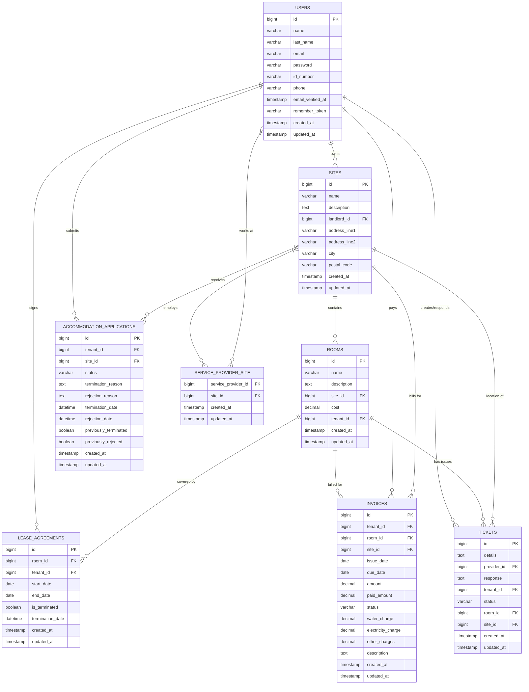

# Tenant Management System

A Laravel Blade-based Tenant Management System for landlords to manage their sites, rooms, tenants, and invoices. This system also includes role-based access control for landlords and tenants.

## Features
- Role-based access control for landlords and tenants.
- Manage sites, rooms, and tenants.
- Generate and print invoices in PDF format.
- Dashboard for viewing invoices and related data.

---

## Database Schema



## Prerequisites
Ensure the following tools are installed:
- PHP 8.2 or later
- Composer
- MySQL or any supported database
- Node.js and npm (for frontend assets)
- A web server like Apache or Nginx

---

## Setup Instructions

### Step 1: Clone the Repository
```bash
git clone https://github.com/Tshabalala-Thabo/TenantManagementSystem.git
cd TenantManagementSystem
```

### Step 2: Install Dependencies
```bash
composer install
npm install
```

### Step 3: Configure Environment Variables
Create a `.env` file by copying the example file:
```bash
cp .env.example .env
```

Open the `.env` file and configure the following:
- **Database Configuration:**
  ```env
  DB_CONNECTION=mysql
  DB_HOST=127.0.0.1
  DB_PORT=3306
  DB_DATABASE=your_database_name
  DB_USERNAME=your_database_user
  DB_PASSWORD=your_database_password
  ```
- **Mail Configuration (optional):**
  If email notifications are required:
  ```env
  MAIL_MAILER=smtp
  MAIL_HOST=smtp.example.com
  MAIL_PORT=587
  MAIL_USERNAME=your_email
  MAIL_PASSWORD=your_password
  MAIL_ENCRYPTION=tls
  MAIL_FROM_ADDRESS=noreply@example.com
  MAIL_FROM_NAME="Tenant Management System"
  ```

### Step 4: Generate Application Key
```bash
php artisan key:generate
```

### Step 5: Run Database Migrations and Seeders
```bash
php artisan migrate --seed
```
This will create the necessary database tables and seed roles (landlord and tenant) into the database.

### Step 6: Link Storage
```bash
php artisan storage:link
```

### Step 7: Compile Frontend Assets
```bash
npm run dev
```

---

## Running the Application
### Development Server
Start the Laravel development server:
```bash
php artisan serve
```

Visit the application at [http://127.0.0.1:8000](http://127.0.0.1:8000).

---


## PDF Invoice Generation
This application uses the `barryvdh/laravel-dompdf` package for PDF generation. Ensure the package is correctly installed:
```bash
composer require barryvdh/laravel-dompdf
```
To generate and view invoices in PDF format, navigate to the Invoices section and click "Print Invoice."

---

